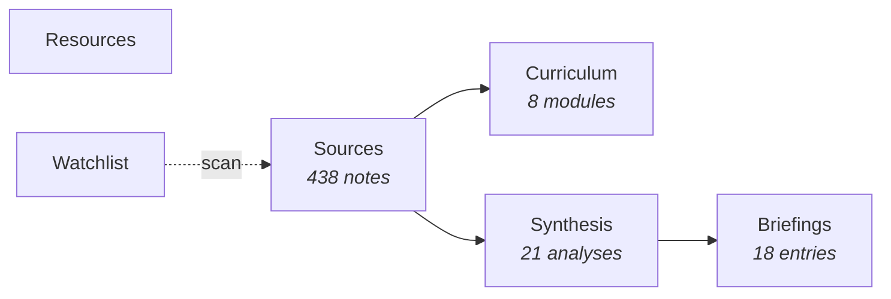
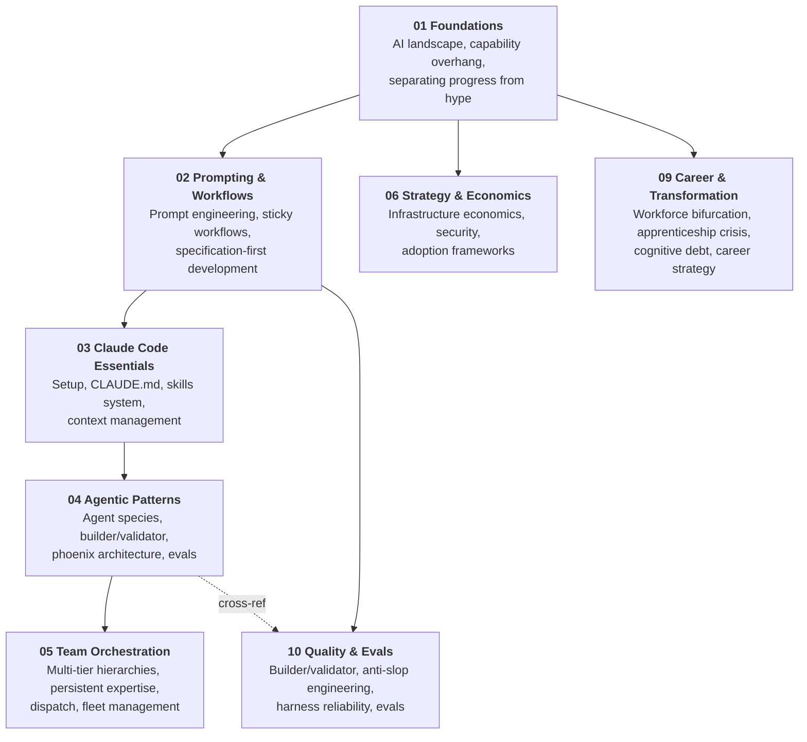
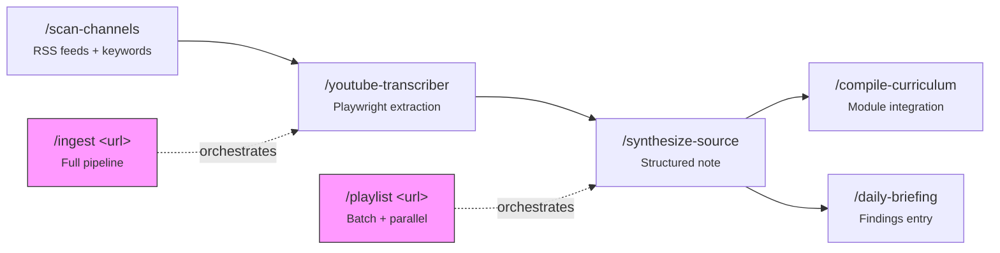

# AI Hype Watcher

Curated AI-assisted development learning resource — from fundamentals to agentic orchestration. Includes critical perspective on AI industry economics, career impact, and hype cycles.

## What This Is

A structured collection of notes, analyses, and learning materials synthesized from YouTube videos, articles, and posts about the rapidly evolving AI-assisted development landscape. The emphasis is on **practical patterns for working engineers** alongside **healthy skepticism** about hype cycles and industry economics.

This repository is maintained with the help of Claude Code skills that automate content workflows — from scanning YouTube channels via RSS feeds, to extracting transcripts with Playwright, synthesizing source notes, compiling curriculum sections, and generating daily briefings.

> **438 sources** from **239 creators** · **21 synthesis docs** · **18 briefings** · **8 curriculum modules**

## Browse

```mermaid
graph LR
    S["Sources<br/><i>438 notes</i>"]
    C["Curriculum<br/><i>8 modules</i>"]
    Y["Synthesis<br/><i>21 analyses</i>"]
    B["Briefings<br/><i>18 entries</i>"]
    R["Resources"]
    W["Watchlist"]

    S --> C
    S --> Y
    Y --> B
    W -.->|scan| S

    click S "sources/" "Individual source notes"
    click C "curriculum/" "Learning path"
    click Y "synthesis/" "Cross-source analyses"
    click B "briefings/" "Daily findings"
    click R "resources/" "External links"
    click W "watchlist/" "YouTube channels"
```

| Section | Description |
|---------|-------------|
| [**Sources**](sources/) | Individual video/article notes with structured metadata and key takeaways |
| [**Curriculum**](curriculum/) | Progressive 8-module learning path from foundations to team orchestration |
| [**Synthesis**](synthesis/) | Cross-source analyses that identify patterns across multiple sources |
| [**Briefings**](briefings/) | Dated entries covering recent AI development findings |
| [**Resources**](resources/) | Curated external links organized by skill level |
| [**Watchlist**](watchlist/) | YouTube channels monitored for new AI dev content |

## Curriculum

```mermaid
graph TB
    M1["<b>01 Foundations</b><br/>AI landscape, capability overhang,<br/>separating progress from hype"]
    M2["<b>02 Prompting & Workflows</b><br/>Prompt engineering, sticky workflows,<br/>specification-first development"]
    M3["<b>03 Claude Code Essentials</b><br/>Setup, CLAUDE.md, skills system,<br/>context management"]
    M4["<b>04 Agentic Patterns</b><br/>Agent species, builder/validator,<br/>phoenix architecture, evals"]
    M5["<b>05 Team Orchestration</b><br/>Multi-tier hierarchies, persistent expertise,<br/>dispatch, fleet management"]
    M6["<b>06 Strategy & Economics</b><br/>Infrastructure economics, security,<br/>adoption frameworks"]
    M9["<b>09 Career & Transformation</b><br/>Workforce bifurcation, apprenticeship crisis,<br/>cognitive debt, career strategy"]
    M10["<b>10 Quality & Evals</b><br/>Builder/validator, anti-slop engineering,<br/>harness reliability, evals"]

    M1 --> M2 --> M3 --> M4 --> M5
    M1 --> M6
    M1 --> M9
    M2 --> M10
    M4 -.->|cross-ref| M10

    click M1 "curriculum/01-foundations/" "Module 01"
    click M2 "curriculum/02-prompting-and-workflows/" "Module 02"
    click M3 "curriculum/03-claude-code-essentials/" "Module 03"
    click M4 "curriculum/04-agentic-patterns/" "Module 04"
    click M5 "curriculum/05-team-orchestration/" "Module 05"
    click M6 "curriculum/06-strategy-and-economics/" "Module 06"
    click M9 "curriculum/09-career-and-transformation/" "Module 09"
    click M10 "curriculum/10-quality-and-validation/" "Module 10"
```

## Key Themes

**The tension between acceleration and judgment** — AI coding tools have reached a genuine inflection point, but the creators who are most effective exercise discipline: reusable systems, validated output, focused tasks, and healthy skepticism.

**The capability overhang** — Most knowledge workers still use AI at a 2023 level. The gap between what's available and what's adopted is the real story of early 2026.

**Infrastructure economics are physical** — DRAM, HBM, TSMC nodes, and GPUs are all supply-constrained. Efficiency isn't optional — it's competitive advantage.

**Quality is the new bottleneck** — 97.5% of agents fail in real-world deployment. The shift from writing code to evaluating code demands new patterns: evals, builder/validator loops, and harness engineering.

**Security matters** — 36% of public agent skills contain security flaws. "Hallucination squatting" is a new class of supply chain attack. Build your own skills; vet everything.

**Career bifurcation is real** — The gap between engineers who specify and validate vs. those who "vibe code" is widening. Apprenticeship pipelines are breaking down as junior roles compress.

## Top Contributors

Creators with 5+ sources in the collection:

| Creator | Sources | Focus |
|---------|:-------:|-------|
| [Nate B Jones](https://www.youtube.com/@NateBJones) | 48 | Infrastructure economics, agent patterns, skills ecosystem |
| [The PrimeTime](https://www.youtube.com/@ThePrimeTimeagen) | 25 | Industry commentary, engineering culture, security |
| [Matt Pocock](https://www.youtube.com/@maaborern) | 16 | TypeScript + AI tooling, context engineering |
| [IndyDevDan](https://www.youtube.com/@indydevdan) | 10 | Agentic coding patterns, multi-agent orchestration |
| [Mo Bitar](https://www.youtube.com/@mobitar) | 10 | AI skepticism, developer workflow critique |
| [Simon Scrapes](https://www.youtube.com/@simonscrapes) | 8 | AI automation, practical tooling |
| [Leon van Zyl](https://www.youtube.com/@leonvanzyl) | 6 | AI coding tutorials, practical workflows |
| [IBM Technology](https://www.youtube.com/@IBMTechnology) | 6 | Enterprise AI, zero trust, agent governance |
| [Noah Vincent](https://www.youtube.com/@noahvincent) | 5 | Claude Code workflows, context engineering |
| [Pivot to AI](https://www.youtube.com/@PivotToAI) | 5 | AI hype critique, industry skepticism |
| [Greg Isenberg](https://www.youtube.com/@GregIsenberg) | 5 | AI business models, startup strategy |
| [Nate Herk](https://www.youtube.com/@nateherk) | 5 | AI automation workflows, enterprise sales |

Plus **227 more creators** across the full [source index](sources/).

## Content Pipeline

```mermaid
flowchart LR
    scan["/scan-channels<br/><small>RSS feeds + keywords</small>"]
    transcribe["/youtube-transcriber<br/><small>Playwright extraction</small>"]
    synth["/synthesize-source<br/><small>Structured note</small>"]
    curriculum["/compile-curriculum<br/><small>Module integration</small>"]
    briefing["/daily-briefing<br/><small>Findings entry</small>"]

    scan --> transcribe --> synth --> curriculum
    synth --> briefing

    ingest["/ingest &lt;url&gt;<br/><small>Full pipeline</small>"]
    playlist["/playlist &lt;url&gt;<br/><small>Batch + parallel</small>"]

    ingest -.->|orchestrates| transcribe
    playlist -.->|orchestrates| synth

    style ingest fill:#f9f,stroke:#333
    style playlist fill:#f9f,stroke:#333
```

| Skill | Purpose |
|-------|---------|
| `/ingest <url>` | Full pipeline — transcribe, synthesize, and index in one step |
| `/playlist <url>` | Process entire YouTube playlist with parallel agent teams |
| `/scan-channels` | Scan YouTube watchlist RSS feeds for new relevant content |
| `/discover` | Browse YouTube beyond the watchlist — topic search, trending, scouting |
| `/synthesize-source` | Convert a URL + transcript into a structured source note |
| `/compile-curriculum` | Rebuild curriculum sections from tagged sources |
| `/daily-briefing` | Generate a dated findings briefing |

## Contributing

This is a personal learning resource that's public for anyone who finds it useful. If you spot errors, have suggestions, or want to recommend sources, open an issue.

## License

[MIT](LICENSE)
