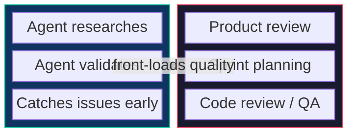
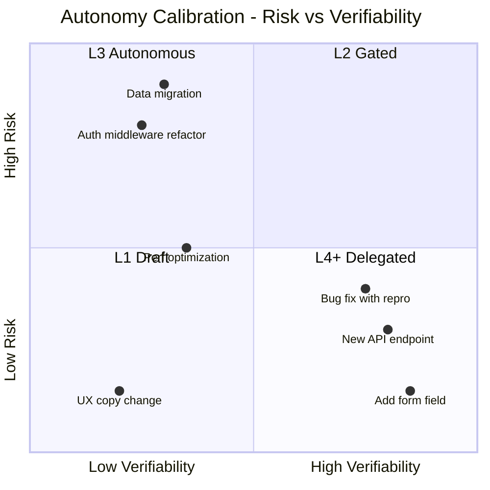
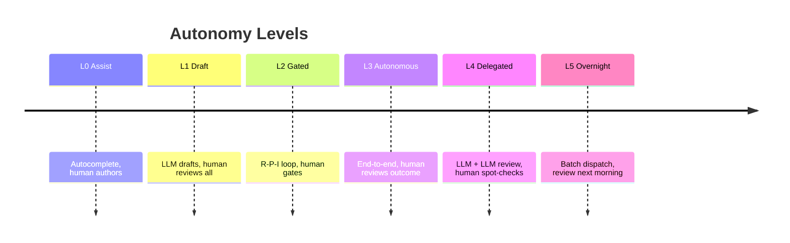
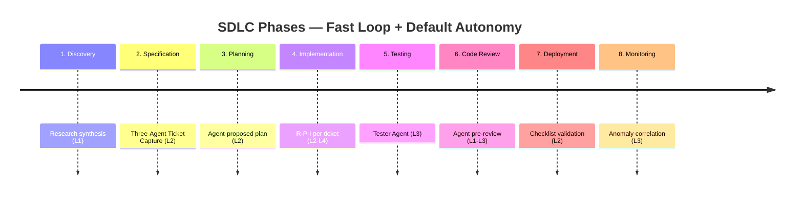
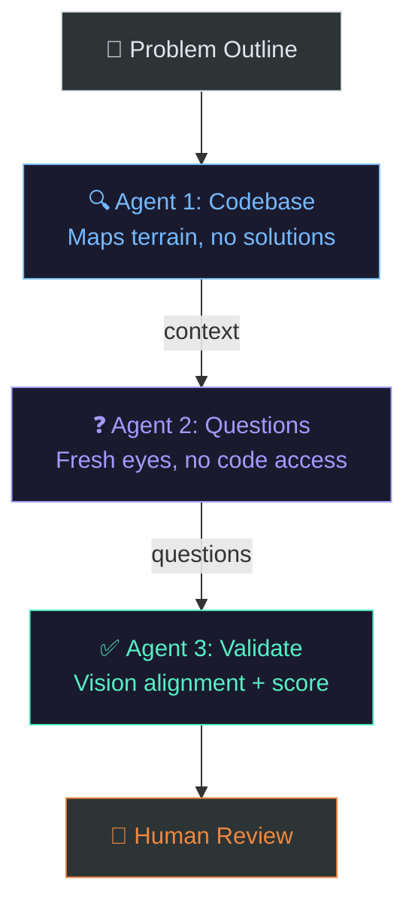
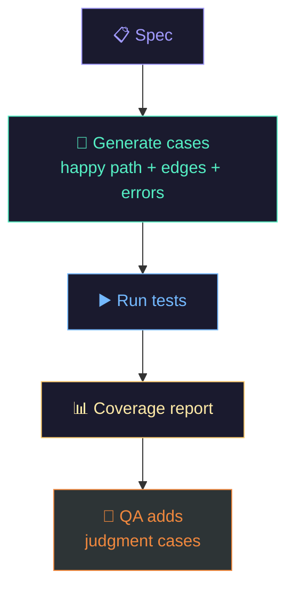
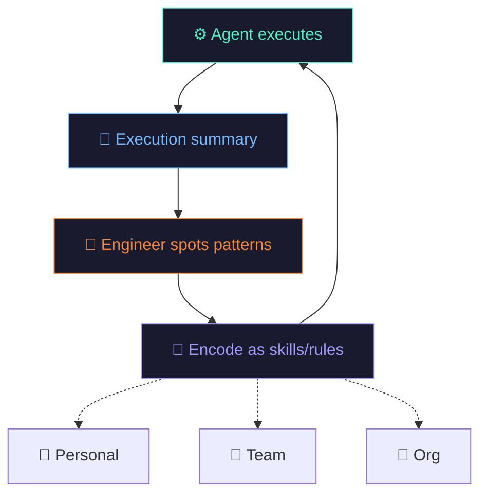
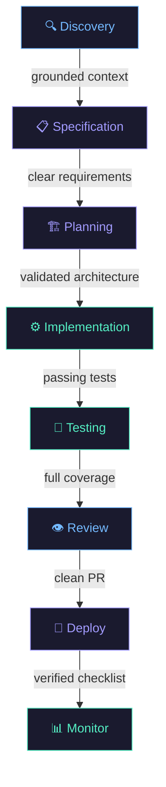

# Research: Agent Feedback Loops Across the SDLC

**Date**: 2026-04-04
**Sources**: #280 (primary), with cross-references to #069, #070, #071, #101, #214, #337, #352, #388, #456, #475
**Focus**: Mapping fast LLM feedback loops (seconds-to-minutes, self-applied) against slow human collaboration loops (days-to-weeks) across each SDLC phase, with an autonomy calibration model for deciding how much to delegate per task.

---

## Overview

The current conversation about AI-assisted development treats agent involvement as binary: either the engineer writes the code or the agent does. This framing misses the structural insight that emerged across 14 sources in this collection: **every SDLC phase already runs a slow human collaboration loop, and AI agents are most effective when they add a fast feedback loop inside that existing rhythm—not when they try to replace it.**

The slow loop is product/design/eng alignment. It runs at days-to-weeks cadence — meetings, async Slack threads, PRD reviews, design critiques, sprint planning. This is where judgment, taste, and strategic alignment happen. It cannot be meaningfully compressed below a minimum human-trust-building threshold.

The fast loop is the LLM quality ratchet. It runs in seconds-to-minutes. Each fast-loop iteration is a free preview of what the slow-loop reviewers will find — catching it now instead of days later.

**The thesis: the goal is not to eliminate the slow loop. The goal is to make each slow-loop checkpoint dramatically more productive by front-loading quality through fast loops.**

This is the structural shift that Dex Horthy describes in [#280](../sources/280-ai-tinkerers-complex-features-ai-agents.md) when he talks about "apparatus engineering" — configuring the environment so agents succeed at the right tasks at the right autonomy level. It's what Scott Logic ([#388](../sources/388-scott-logic-agentic-engineering-delivery.md)) calls becoming an "environment architect."

---

## The Autonomy Calibration Model

Not all tasks deserve the same agent autonomy. Dex Horthy ([#280](../sources/280-ai-tinkerers-complex-features-ai-agents.md)) describes this as a spectrum calibrated by three dimensions:

| Dimension | Low Autonomy | High Autonomy |
|-----------|-------------|---------------|
| **Risk** | High blast radius (shared infra, data migration) | Isolated change (new endpoint, UI component) |
| **Verifiability** | Subjective quality (UX, architecture taste) | Clear pass/fail signal (tests, type checks, linter) |
| **Spec clarity** | Ambiguous ("improve performance") | Precise acceptance criteria ("add field X with validation Y") |

These three dimensions combine into six practical autonomy levels:

**L0 — Assist**: Autocomplete, inline suggestions. The human is still the primary author. Copilot-tier.

**L1 — Draft**: The LLM produces a complete first draft. The human reviews everything before it moves forward. Where most teams start.

**L2 — Gated**: The LLM executes through the research-plan-implement loop ([#280](../sources/280-ai-tinkerers-complex-features-ai-agents.md)) with human review gates between phases. Sweet spot for medium-risk work — the agent does the heavy lifting but the human maintains understanding at each phase boundary.

**L3 — Autonomous**: The LLM executes end-to-end; the human reviews only the final outcome. Requires strong test coverage as the objective completion signal. As Willison argues ([#475](../sources/475-the-pragmatic-engineer-agent-tdd-practices.md)), tests are "free to generate" with LLMs, making them the enabler of L3.

**L4 — Delegated**: The LLM executes and a separate LLM reviews. The human spot-checks. The Overstory swarm ([#101](../sources/101-jaymin-west-self-improving-swarm.md)) demonstrated this — 22 agents processing 9 issues, 26 commits, only 2 human prompts.

**L5 — Overnight**: Batch dispatch at end of day. This is Dex's "XP waste" vision ([#280](../sources/280-ai-tinkerers-complex-features-ai-agents.md)) and Karpathy's AutoResearch ([#337](../sources/337-karpathy-code-agents-autoresearch.md)). The prerequisites are severe: spec quality, stuck-detection, test signals, and months of L2-L4 experience. This is the destination, not the starting point.

**The critical insight: autonomy is a dial set per task, not per team or per tool.** The same engineer might run at L5 for adding API fields with clear schemas and at L2 for refactoring a shared authentication module.

---

## Phase-by-Phase Breakdown

### Phase 1: Discovery

**Slow loop**: Product team identifies market opportunity, customer pain, strategic fit. Days-to-weeks of customer calls, data analysis, competitive review.

**Fast loop**: LLM-assisted research synthesis. Given a problem statement, an agent searches internal context (Jira history, Slack discussions, past decisions, meeting notes), external sources, and competitor surfaces. Produces a structured brief: what we already know, what adjacent teams have tried, what external evidence exists.

**Catch-it-now**: Prevents "we already tried this" or "another team is working on this" from surfacing weeks into the discovery cycle.

**Integration point**: The research brief becomes input to the first product review meeting, compressing weeks of background research into the meeting prep.

**Default autonomy**: L1 (Draft). Discovery is inherently subjective and strategic—the agent provides raw material, the human synthesizes judgment.

**Source evidence**: Karpathy's AutoResearch ([#337](../sources/337-karpathy-code-agents-autoresearch.md))—agents autonomously gathering and synthesizing research. The `program.md` concept—organizational context described as searchable documents.

---

### Phase 2: Specification

**Slow loop**: Product/design/eng collaborate on requirements. PRDs, user stories, acceptance criteria. Typically 1-2 week cycle with async review rounds.

**Fast loop**: **The Three-Agent Ticket Capture pattern** (detailed below). Three agents with isolated context windows iterate on the specification in minutes, each applying a different lens.

**Catch-it-now**: Prevents three classes of error:
- "The spec doesn't account for how our system actually works" (caught by Agent 1)
- "The spec is ambiguous in ways we won't discover until implementation" (caught by Agent 2)
- "The spec contradicts our product vision" (caught by Agent 3)

All three would otherwise surface 1-2 sprints later as rework.

**Integration point**: The three-agent output is a "specification readiness report" that accompanies the human-written PRD. It doesn't replace the PRD—it pre-validates it. The product review meeting starts from "here's the spec AND here's what three independent LLM passes found" rather than raw spec text.

**Default autonomy**: L2 (Gated). Specification is too important to run autonomously—but the fast loop dramatically improves the quality of what enters the slow loop.

**Source evidence**: Dex Horthy's Mom Test discipline ([#280](../sources/280-ai-tinkerers-complex-features-ai-agents.md))—strip solution details from specs. IBM spec-driven development ([#214](../sources/214-ibm-technology-spec-driven-development.md))—gates between specification and planning. BMAD multi-agent roles ([#456](../sources/456-awesome-spec-driven-dev-critique.md))—agents with distinct perspectives communicating via markdown. Fowler's cognitive debt ([#071](../sources/071-martin-fowler-future-software-dev.md))—requiring LLMs to surface understanding gaps prevents debt accumulation.

---

### Phase 3: Planning / Architecture

**Slow loop**: Technical leads design architecture, break work into tickets, sequence dependencies. Sprint planning ceremony. 1-2 days.

**Fast loop**: Agent reads the validated spec, the existing codebase, and the architecture docs, then produces a proposed implementation plan: file-level changes, dependency order, risk areas, estimated scope per ticket. The engineer reviews this plan—it's a tracer bullet at the planning level ([#280](../sources/280-ai-tinkerers-complex-features-ai-agents.md)).

**Catch-it-now**: Prevents "we didn't realize this touches three other services" and "the ticket breakdown doesn't match how the code is actually organized" from emerging mid-sprint.

**Integration point**: The agent-generated plan becomes a draft for sprint planning. Engineers edit it, not author it from scratch. Planning meetings shift from "what should we do?" to "is this plan right?"

**Default autonomy**: L2 (Gated). Architecture decisions have high blast radius and require taste—but the agent's plan draft saves hours of manual codebase exploration.

**Source evidence**: Dex Horthy's tracer bullets ([#280](../sources/280-ai-tinkerers-complex-features-ai-agents.md)). Scott Logic's "environment architect" framing ([#388](../sources/388-scott-logic-agentic-engineering-delivery.md))—engineers create conditions for agent success, including planning structures.

---

### Phase 4: Implementation

**Slow loop**: Sprint execution. Engineers write code, review PRs, handle blockers. 1-2 week sprint.

**Fast loop**: The research-plan-implement loop ([#280](../sources/280-ai-tinkerers-complex-features-ai-agents.md)) runs *within* each ticket's implementation. For each ticket: agent reads relevant code (research), proposes approach (plan), implements and runs tests (implement). If tests fail, the agent iterates within the implement phase. If it gets stuck, it flags for human intervention rather than spinning.

**Catch-it-now**: Prevents "the code compiles but doesn't pass tests" and "the implementation drifted from the spec" from reaching code review.

**Integration point**: PRs arrive at the slow loop (code review) in a pre-validated state: tests pass, linter clean, spec alignment documented. The reviewer's job shifts from "does this work?" to "is this the right approach?"

**Default autonomy**: L2-L4 (varies by risk). This is where the autonomy calibration model earns its keep. Low-risk, well-specified tickets with good test coverage run at L3-L4. High-risk infrastructure changes stay at L2.

**Source evidence**: Willison's red-green TDD ([#475](../sources/475-the-pragmatic-engineer-agent-tdd-practices.md))—tests as the objective completion signal. Harness engineering ([#352](../sources/352-the-ai-automators-harness-engineering-reliability.md))—phased execution with validation gates. GitHub's continuous agentic pressure ([#069](../sources/069-eddie-aftandilian-agentic-workflows.md))—100+ agents applying quality ratchet to every dimension.

---

### Phase 5: Testing

**Slow loop**: QA cycle. Test plan execution, regression testing, edge case discovery. Days.

**Fast loop**: **The Tester Agent** (detailed below). An agent generates test cases from the specification (not from the implementation—avoiding confirmation bias), runs them, identifies gaps, and produces a test coverage report. For L4 autonomy tasks, the tester agent and the implementation agent are separate—one generates the PR, another validates it.

**Catch-it-now**: Prevents "we missed an edge case that the spec clearly implies" and "test coverage is insufficient for deployment confidence" from reaching the QA signoff meeting.

**Integration point**: The agent-generated test suite and coverage report are reviewed by QA in the slow loop. QA shifts from writing tests to evaluating test adequacy and adding judgment-intensive edge cases the agent can't derive from the spec alone.

**Default autonomy**: L3 (Autonomous). Test generation from specs has clear pass/fail signals and low blast radius—if a generated test is wrong, it fails and gets caught. This is one of the highest-ROI phases for agent autonomy.

**Source evidence**: Willison's TDD practices ([#475](../sources/475-the-pragmatic-engineer-agent-tdd-practices.md))—tests are "free to generate." Karpathy's AutoResearch ([#337](../sources/337-karpathy-code-agents-autoresearch.md))—agents optimizing against verifiable metrics. Overstory swarm ([#101](../sources/101-jaymin-west-self-improving-swarm.md))—builder and reviewer agents in isolated contexts.

---

### Phase 6: Code Review

**Slow loop**: Senior engineer review, architectural feedback, knowledge transfer. Hours-to-days.

**Fast loop**: Agent performs automated pre-review: checks for common anti-patterns, verifies spec alignment, runs security scans, validates naming conventions and documentation. Produces a "review readiness" summary that tells the human reviewer where to focus their limited attention.

**Catch-it-now**: Prevents "the reviewer spends 30 minutes on formatting and naming issues before getting to architectural concerns." The fast loop handles mechanical review; the slow loop handles judgment.

**Integration point**: The human reviewer receives a PR with the agent's pre-review notes attached. They skip the mechanical checks and go straight to questions that require human judgment: "Is this the right abstraction? Does this align with our long-term architecture? Will this be maintainable?"

**Default autonomy**: L1-L3 (varies). Automated lint/security scans run at L3. Architectural review assistance stays at L1—the agent surfaces observations, the human makes the call.

**Source evidence**: GitHub's 100+ specialized agents ([#069](../sources/069-eddie-aftandilian-agentic-workflows.md))—each handling a specific quality dimension. Fowler's cognitive debt ([#071](../sources/071-martin-fowler-future-software-dev.md))—requiring agents to explain output so reviewers maintain understanding rather than rubber-stamping.

---

### Phase 7: Deployment

**Slow loop**: Release management, staging validation, canary deployment, rollback planning. Hours-to-days depending on risk.

**Fast loop**: Agent validates deployment readiness: checks that all tests pass in CI, all review comments are resolved, all dependent services are compatible, feature flags are configured, and rollback procedures are documented. Produces a deployment checklist with pass/fail per item.

**Catch-it-now**: Prevents "we deployed without realizing a dependent service hadn't been updated" and "we forgot to update the feature flag configuration."

**Integration point**: The deployment decision remains human (this is a slow-loop judgment call about risk and timing), but the information supporting that decision is agent-compiled and verified.

**Default autonomy**: L2 (Gated). Deployment has high blast radius. The agent assembles the checklist; the human makes the go/no-go call.

**Source evidence**: Harness engineering ([#352](../sources/352-the-ai-automators-harness-engineering-reliability.md))—phased execution with file-system checkpoints enabling resumption.

---

### Phase 8: Monitoring / Post-Deploy

**Slow loop**: Incident response, performance reviews, retrospectives. Days-to-weeks.

**Fast loop**: Agent monitors error rates, latency, and anomalous patterns post-deployment. Produces an automated health report within the first hour. If anomalies are detected, the agent drafts an incident assessment with likely root causes based on what changed in the deployment.

**Catch-it-now**: Prevents "nobody noticed the error rate spike until a customer complained." The fast loop creates a proactive alerting layer with contextual understanding—it knows what just deployed and can correlate anomalies with specific changes.

**Integration point**: The monitoring report feeds into the next sprint's retrospective. Patterns across deployments accumulate into the episodic feedback loop (execution summaries → engineer observation → encoded as skills/rules).

**Default autonomy**: L3 (Autonomous). Monitoring is read-only with clear signals. The agent detects and reports; the human decides whether and how to act.

**Source evidence**: GitHub's continuous agentic pressure ([#069](../sources/069-eddie-aftandilian-agentic-workflows.md))—always-on improvement agents. Karpathy's persistent autonomous systems ([#337](../sources/337-karpathy-code-agents-autoresearch.md)).

---

## Deep Dive: The Three-Agent Ticket Capture Pattern

This is the fast loop for the Specification phase — a multi-agent pattern that stress-tests a rough problem outline through three distinct lenses before it enters the slow human review cycle.

> **Total wall-clock time**: 5-15 minutes. Three isolated context windows, three distinct lenses, one pre-validated spec.

### Agent 1 — Codebase Agent (Read-Only Researcher)

**Input**: Rough problem outline (description of what needs to change and why)

**Context**: Full access to the relevant codebase—CLAUDE.md, relevant service files, database schema, recent PRs touching the affected area, existing test patterns.

**Task**: Augment the problem outline with implementation reality. Identify: (a) which files and services are affected, (b) what existing patterns constrain the solution, (c) what test infrastructure exists in the affected area, (d) what recent changes might conflict.

**Output**: An augmented problem outline with a "codebase context" appendix. This is a markdown document, not code.

**Critical rule**: This agent does NOT propose solutions. It maps the terrain so subsequent agents have grounded context. Keeping it solution-free prevents premature implementation bias—the same discipline Dex describes with the Mom Test ([#280](../sources/280-ai-tinkerers-complex-features-ai-agents.md)).

### Agent 2 — Problem Definition Agent (Fresh Perspective)

**Input**: Agent 1's markdown output. Crucially, this agent does NOT have direct codebase access—it works entirely from Agent 1's document. This is a deliberate fresh-context design.

**Context**: The augmented problem outline from Agent 1, plus relevant product documentation (PRDs, user stories, past decisions, architectural decision records).

**Task**: Generate validation questions. These are the questions that, if answered, would eliminate ambiguity from the specification. Categories:
- **Scope questions**: "Does this include X or is X out of scope?"
- **Constraint questions**: "What happens when Y?"
- **Priority questions**: "If we can only do A or B, which matters more?"
- **Integration questions**: "How does this interact with Z?"

**Output**: A structured list of 10-20 validation questions, ranked by ambiguity severity. This is the specification's "test suite"—questions that must have clear answers before implementation begins.

**Critical rule**: Fresh context is the feature. Without direct codebase access, this agent asks "dumb questions" that an insider would skip—questions whose answers feel obvious to the team but often aren't documented anywhere. These are precisely the questions that surface ambiguities that would otherwise become bugs.

### Agent 3 — Validation Agent (Vision Alignment)

**Input**: Agent 2's validation questions plus the original problem outline.

**Context**: Product vision documents, architectural decision records, team conventions, relevant Jira epics—the "why" layer of the organization, not implementation details.

**Task**: (a) Answer each validation question using available context. (b) Flag questions that cannot be answered—these require human input and are the highest-value items for the upcoming review meeting. (c) Check that the specification (problem outline + answers) aligns with the product vision. (d) Produce a specification readiness score indicating how much ambiguity remains.

**Output**: A validated specification document with: (a) each question answered or flagged, (b) a readiness assessment, (c) a list of items requiring human decision before implementation can begin.

**Critical rule**: This agent does NOT add new questions—it answers existing ones and identifies gaps. The readiness score gives the human a clear signal: "This spec is 85% ready; here are the 3 items you need to decide."

### Orchestration

Agents run sequentially: 1 → 2 → 3. Each agent's output is a markdown file in a shared workspace. Total wall-clock time: 5-15 minutes depending on codebase size and question count. The output feeds directly into the next human review meeting—the slow loop checkpoint is dramatically more productive because the spec arrives pre-validated with explicit remaining ambiguities rather than unknown unknowns.

---

## Deep Dive: The Tester Agent

The Tester Agent is the fast loop for the Testing phase. Its key design principle is **specification-derived test generation** — generating test cases from the spec, not from the implementation.

Why this matters: tests generated from the implementation confirm what the code *does*, not what it *should do*. Tests generated from the spec test intended behavior, and when they fail, the failure is meaningful — a gap between intent and reality.

For tasks at L4 autonomy, the Tester Agent operates independently from the Implementation Agent — one generates the PR, the other validates it. The human reviews the coverage report and adds judgment-intensive edge cases the agent can't derive from the spec alone (race conditions, adversarial inputs, business-logic corner cases that require domain expertise).

---

## The Episodic Feedback Meta-Loop

Above all eight phases sits a meta-loop that makes the fast loops improve over time:

This is the "slow loop that makes fast loops faster." It operates at a different cadence from the per-phase slow loops — a weekly or sprint-level reflection on how the agents are performing across all phases.

This maps to what Karpathy ([#337](../sources/337-karpathy-code-agents-autoresearch.md)) calls `program.md` — the organization described as markdown that agents execute against. Different program.md configurations produce different outcomes. The episodic feedback loop is the mechanism by which the organization's program.md evolves.

---

## The Compound Effect

If each phase's fast loop catches 60-80% of issues that would have surfaced in the next human review cycle, the velocity increase is not additive — it's multiplicative. Each phase starts from a higher-quality baseline:

Without fast loops, each phase inherits raw, unvalidated output:
- Specification starts from **assumptions** → Planning starts from **ambiguous prose** → Implementation discovers **constraints mid-build** → Code review catches **bugs instead of judging architecture** → Deployment proceeds on **hope**

With fast loops, each phase inherits pre-validated output:
- Specification starts from **grounded context** → Planning starts from **clear requirements** → Implementation follows **validated architecture** → Code review focuses on **judgment** → Deployment proceeds with **confidence**

The agent isn't replacing any human checkpoint. It's ensuring that when the human shows up, the work is already 80% validated. The human's judgment is applied to the remaining 20% — the part that actually requires human judgment.

The 10x velocity Dex describes ([#280](../sources/280-ai-tinkerers-complex-features-ai-agents.md)) is not about any single agent running 10x faster. It's about eight phases each starting from a dramatically higher baseline, compounding across the full cycle.

---

## Summary Table

| Phase | Slow Loop (Human) | Fast Loop (LLM) | Catch-it-now Signal | Default Autonomy |
|-------|-------------------|------------------|---------------------|-----------------|
| Discovery | Customer calls, market analysis | Internal/external research synthesis | "We already tried this" | L1 Draft |
| Specification | PRD review rounds | Three-Agent Ticket Capture | Spec ambiguity, vision drift | L2 Gated |
| Planning | Sprint planning, architecture | Agent-proposed file-level plan | "Touches 3 services we didn't expect" | L2 Gated |
| Implementation | Sprint execution | Research/plan/implement per ticket | Tests fail, spec drift | L2-L4 by risk |
| Testing | QA cycle | Tester Agent (spec-derived cases) | Missed edge cases, coverage gaps | L3 Autonomous |
| Code Review | Senior eng review | Agent pre-review (patterns, security) | Mechanical issues consuming review time | L1-L3 varies |
| Deployment | Release management | Deployment checklist validation | Missing dependency, stale config | L2 Gated |
| Monitoring | Incident response, retros | Contextual anomaly correlation | Error spike nobody noticed | L3 Autonomous |
